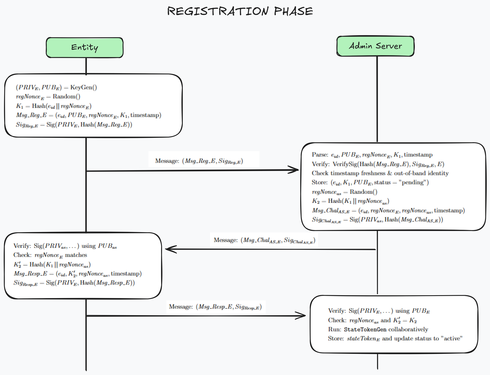
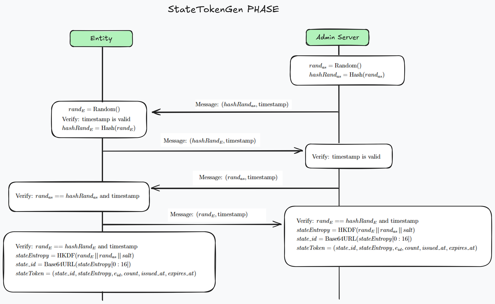
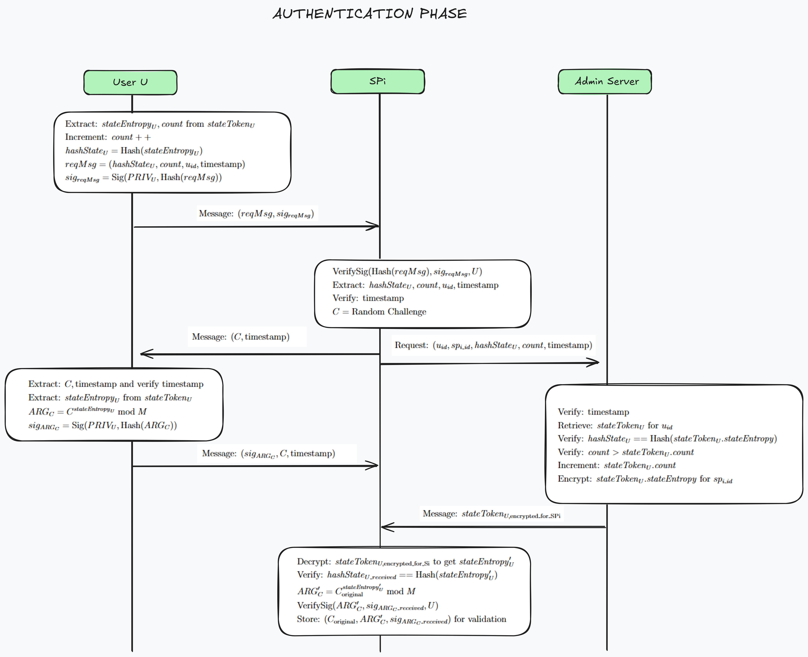
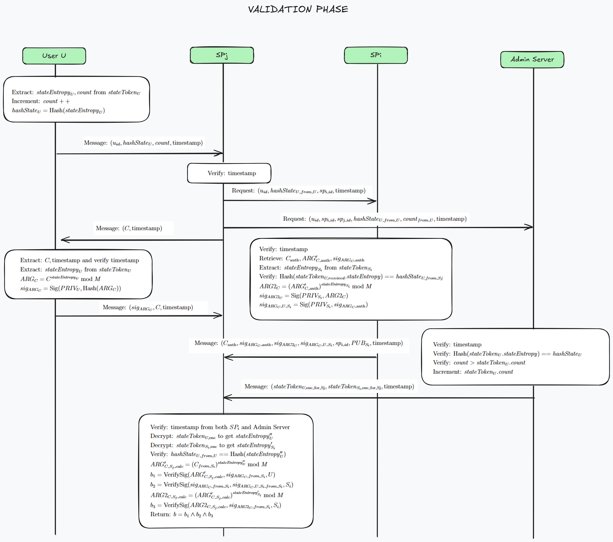
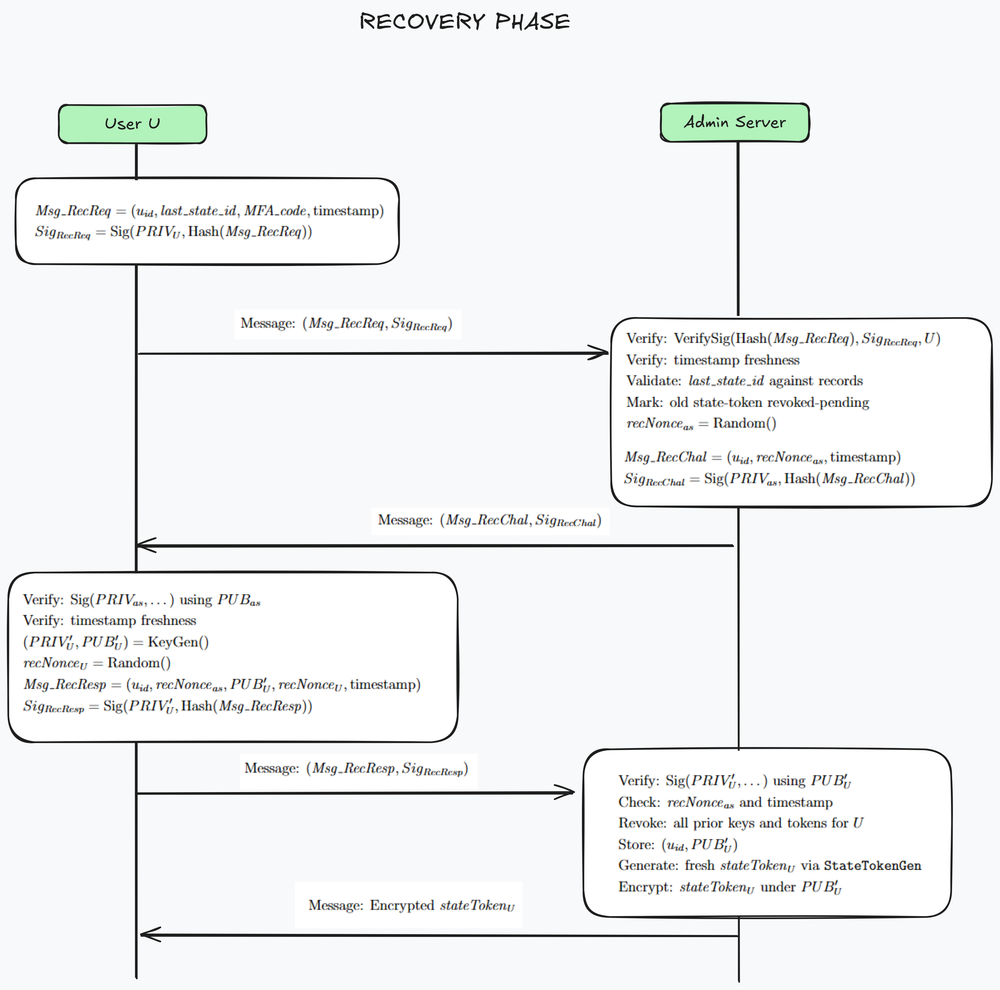

# State Token Relay Protocol (STRP) - Analysis Repository

This repository contains comprehensive analysis for the **State Token Relay Protocol (STRP)**, a secure authentication mechanism for multi-server environments, supporting the paper submitted to PKIA 2025.

## Navigation

- 🔄 **[Protocol Flow Diagrams](#protocol-phases)** - Visual sequence diagrams for all five protocol phases
- 🔒 **[Formal Security Analysis](#formal-analysis-of-strp-protocol-using-proverif)** - ProVerif verification scripts and security proofs  
- ⚡ **[Performance Analysis](#strp---comparative-performance-analysis)** - Computational cost comparison with existing protocols

---

# State Token Relay Protocol (STRP) - Visual Flow Diagrams

This repository contains supplementary visual artifacts for the paper titled **"A Usable And Secure Authentication for Multi-server Environments to Enhance Digital Trust"** (Paper ID: 58), submitted to PKIA 2025.

The following sequence diagrams illustrate the communication flow for each of the five core phases of the STRP.

## Overview

The State Token Relay Protocol (STRP) provides a secure authentication mechanism for multi-server environments. This repository contains visual representations of the protocol's five core phases, each demonstrating different aspects of the authentication and security flow.

## Protocol Phases

### 1. Registration Phase

This diagram illustrates the initial process where an entity (User or Service Provider) establishes a secure cryptographic identity with the Admin Server.



### 2. StateTokenGen Phase

This diagram shows the collaborative commit-reveal scheme between an entity and the Admin Server. This process is used to securely generate the shared secret entropy that forms the basis of the stateToken.



### 3. Authentication Phase

This diagram details the primary authentication flow where a User proves their identity to a Service Provider (SPi). The process involves a challenge-response mechanism mediated by the Admin Server, which provides the necessary encrypted state information.



### 4. Validation Phase

This diagram outlines the chained authentication process. It shows how a new Service Provider (SPj) can validate a User by leveraging a prior, trusted authentication session the User had with another provider (SPi), ensuring seamless and secure access across the multi-server environment.



### 5. Recovery Phase

This diagram shows the secure process for a User to recover their account after a potential credential compromise. The flow allows the User to establish a new key pair and generate a fresh stateToken with the Admin Server.



## Image Files

The following diagram files are included in this repository:

- Registration.png
- StateTokenGen.png
- Authentication.png
- Validation.png
- Recovery.png

## Protocol Security Features

- **Multi-server Authentication**: Seamless authentication across multiple service providers
- **State Token Management**: Secure generation and management of authentication tokens
- **Recovery Mechanisms**: Built-in account recovery procedures
- **Cryptographic Security**: Strong cryptographic foundations for all operations
- **Chained Validation**: Efficient validation leveraging prior authentication sessions

## Usage

To view the complete protocol flow:

1. Clone this repository
2. Ensure all image files are present in the root directory
3. View the README.md file in any Markdown viewer or GitHub

---

# Formal Analysis of STRP Protocol using ProVerif

This repository contains the ProVerif scripts for the formal security analysis of the STRP protocol. The analysis covers two main phases of the protocol: Registration and Authentication.

## Overview

The STRP protocol is designed to enable secure communication and mutual authentication between users and multiple services in a multiserver environment. This formal analysis aims to verify key security properties under the Dolev-Yao attacker model, which assumes the attacker has full control over the network.

## Tool Used

- **ProVerif:** An automatic cryptographic protocol verifier. More information can be found on the [ProVerif website](https://proverif.inria.fr/).

## Repository Structure

The repository includes the following ProVerif (`.pv`) files:

- `Registration.pv`: Models the registration phase where entities (Users/Servers) establish their identities and credentials with an Admin Server. This phase is assumed to occur over a secure (private) channel.
- `Authentication.pv`: Models the authentication phase where a User authenticates to one or more Servers (Si, Sj) potentially involving interaction with an Admin Server. This phase largely occurs over public channels.
- `Authentication_output.txt`: This file contains the actual output that the Proverif script Authentication.pv generates.
- `Registration_output.txt`: This file contains the actual output that the Proverif script Registration.pv generates. 

## Security Properties Verified

The ProVerif scripts check for the following crucial security properties:

1.  **Secrecy:**
    - Confidentiality of long-term secret keys (e.g., `skE_actual`, `skAS_actual`, `skU_actual`, `skSi_actual`, `skSj_actual`).
    - Confidentiality of session-specific secrets generated during the protocol execution (e.g., `state_u`, `state_si`, `C_challenge`).
2.  **Authentication (Correspondence):**
    - Ensuring that when one party (e.g., a server) believes it has successfully authenticated another party (e.g., a user), the latter party indeed actively participated in the protocol with the intention to authenticate.
    - Verified for:
      - Admin Server completing registration initiated by an Entity.
      - Server Si authenticating User U.
      - Server Sj authenticating User U (in the context of communication involving Si).
3.  **Integrity (Injectivity):**
    - Ensuring a one-to-one mapping between corresponding protocol events (e.g., an authentication completion event at a server uniquely corresponds to an authentication initiation event by a user). This helps protect against certain forms of replay and impersonation attacks.

## Modeling Assumptions

Key assumptions made in the ProVerif models include:

- **Ideal Cryptography:** Cryptographic primitives (hashing, signatures, encryption) are assumed to be perfect (e.g., no algorithmic weaknesses).
- **Dolev-Yao Attacker:** The attacker can intercept, modify, inject, and delete messages on public channels but cannot break ideal cryptographic primitives without the necessary keys.
- **Private Channel for Registration:** The `Registration.pv` model assumes a secure (confidential and authenticated) channel between the Entity and the Admin Server (denoted `E_AS: channel [private]`).
- **Abstracted Operations:** Certain operations, like exponentiation (`pow`), are modeled as uninterpreted functions with their defined properties. Timestamp freshness checks and out-of-band verifications mentioned in protocol descriptions are generally abstracted and not explicitly modeled unless directly influencing message flow or cryptographic operations.
- **Pre-shared Keys/Trust:** The existence and secure pre-distribution of certain public keys or trust relationships are assumed where necessary (e.g., servers knowing public keys of other trusted servers or the Admin Server).

## How to Run the Scripts

To verify the protocols using ProVerif:

1.  Ensure ProVerif is installed on your system.
2.  Navigate to the directory containing the `.pv` files.
3.  Run ProVerif from the command line:

    ```bash
    proverif Registration.pv
    proverif Authentication.pv
    ```

4.  Examine the output. ProVerif will indicate whether the queried properties hold (`RESULT ... is true`) or if it found a potential attack trace.

## Disclaimer

This formal analysis provides a level of assurance regarding the specified security properties within the defined model. It does not cover all possible security aspects, such as side-channel attacks, denial-of-service vulnerabilities not related to logical flaws, or implementation errors.

---

# STRP - Comparative Performance Analysis

## Overview

This document presents a comparative performance analysis of STRP (Secure Token-based Registration Protocol) against several recent and relevant authentication protocols in multi-server environments.

## Comparative Performance Analysis

To evaluate the practicality and efficiency of STRP, we conducted a comparative analysis of its cryptographic operational costs against several recent and relevant protocols.

The results in the table below highlight the different design trade-offs made by each protocol:

- **Xiong et al.**: Achieves strong anonymity through proxy resignature but incurs a very high cost in asymmetric operations
- **Conners et al.**: Certificate-based approach relies heavily on a public key infrastructure, leading to a high number of signature and verification operations
- **Yeoh et al. (FIDO-AC)**: Represents the state-of-the-art but its core security relies on Zero-Knowledge Proofs (ZKPs), which are computationally intensive for the client device

In contrast, **STRP demonstrates a balanced and efficient design**. It avoids the most expensive cryptographic primitives like bilinear pairings and ZKPs, positioning it as a practical and scalable solution for real-world multi-server environments.

## Performance Comparison Table

| Operation | STRP (Ours) | Xiong et al. | Conners et al. | Yeoh et al. |
|-----------|-------------|--------------|----------------|-------------|
| Hashing (H) | 7 | 5 | ~9* | ~4* |
| Signatures (Sig) | 2 | - | 4 | 2 |
| Verifications (Ver) | 2 | - | 5 | 2 |
| Modular Exp (Exp) | 4 | 12 | - | - |
| Bilinear Pairings (Pair) | - | 2 | - | - |
| Symmetric Enc/Dec | 2 pairs | 1 pair | - | - |
| ZKP Generation | - | - | - | 1 |
| ZKP Verification | - | - | - | 1 |

*\*Hashing is an implicit part of each signature/verification, estimated as 1 hash per operation.*

## Key Advantages of STRP

1. **Balanced Performance**: Optimized trade-off between security and computational efficiency
2. **Practical Design**: Avoids computationally expensive primitives like bilinear pairings and ZKPs
3. **Scalability**: Suitable for real-world multi-server environments
4. **Efficiency**: Lower overall cryptographic operational costs compared to competing protocols

## Protocol Analysis Summary

- **STRP**: Focuses on practical efficiency with moderate use of standard cryptographic operations
- **Xiong et al.**: High security through proxy resignature but computationally expensive
- **Conners et al.**: PKI-dependent with high signature/verification overhead
- **Yeoh et al.**: Advanced security features but resource-intensive ZKP operations

This analysis demonstrates STRP's effectiveness as a practical solution for secure multi-server authentication scenarios.
